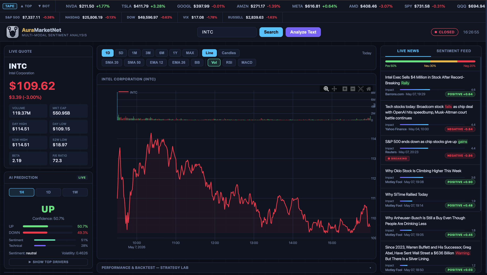

<p align="center">
  
</p>
#AuraMarketNet
**Real-Time Multi-Modal Sentiment Analysis**

It's a production-grade deep learning system that jointly encodes financial news sentiment and OHLCV time-series data to predict next-day market direction, expected return magnitude, and volatility. Built as a full-stack capstone: model training, fine-tuned sentiment engine, live REST/WebSocket API, professional backtesting, and a real-time quant terminal dashboard.




##API Reference

All endpoints return JSON. The dashboard runs on **port 8080** by default (`PORT` env var overrides).

###Market Data

| Method | Endpoint | Description |
|---|---|---|
| GET | `/api/price?ticker=AAPL` | Live quote: price, change, volume, market cap |
| GET | `/api/history?ticker=AAPL&range=1D` | OHLCV arrays for charting (`1D/5D/1W/1M/3M/6M/1Y/MAX`) |
| GET | `/api/ticker_tape` | Live quotes for all tracked tickers |
| GET | `/api/market_status` | US equity market open/closed + session times |
| GET | `/api/market_overview` | S&P 500, NASDAQ, DOW, VIX |
| GET | `/api/sparklines?tickers=AAPL,TSLA` | Last 30 hourly prices per ticker (watchlist) |
| GET | `/api/top_movers?n=6` | Top N gainers and losers |
| GET | `/api/company_info?ticker=AAPL` | Name, sector, description |

###Prediction & Sentiment

| Method | Endpoint | Description |
|---|---|---|
| GET | `/api/predict?ticker=AAPL&horizon=1D` | Full AuraMarketNet prediction (1H/1D/1W) |
| POST | `/api/analyze_text` | Body `{"text":"...", "ticker":"AAPL"}` — sentiment + market prediction |
| GET | `/api/sentiment_feed?ticker=AAPL` | FinBERT batch inference on live news |
| GET | `/api/news?ticker=AAPL&limit=20` | News with impact score, breaking flag, keyword highlights |
| POST | `/api/predict-sentiment` | Body `{"text":"..."}` or `{"texts":[...]}` — raw FinBERT inference |
| POST | `/api/predict-market-signal` | Body `{"texts":[...], "weights":[...]}` — aggregate bullish/neutral/bearish signal |
| GET | `/api/model_status` | Model health, checkpoint epoch, val accuracy, sentiment engine |

###Backtesting

| Method | Endpoint | Description |
|---|---|---|
| GET | `/api/backtest?ticker=AAPL&strategy=rsi&days=252` | Run backtest (`strategy`: rsi/ma_cross/momentum/volatility/ai/all) |

Optional params: `commission` (default 0.001), `slippage` (0.0005), `stop_loss` (disabled by default), `days` (max 756).

###WebSocket (Flask-SocketIO)

Connect to `ws://localhost:8080/socket.io`. Server pushes `ticker_tape` and `market_status` every 5 seconds to all connected clients. Emit `subscribe_ticker` with `{"ticker": "AAPL"}` for an immediate quote snapshot.

---

##GPU Deployment (RunPod)

Quick summary:

```bash
#On the pod
git clone https://github.com/MahadeMishuk/AuraMarketNet.git
cd AuraMarketNet
pip install -r requirements.txt

#Sentiment fine-tuning
python train_sentiment.py --epochs 10 --num-workers 4

#Full model training
python train.py --epochs 30 --batch-size 32 --num-workers 4

```
